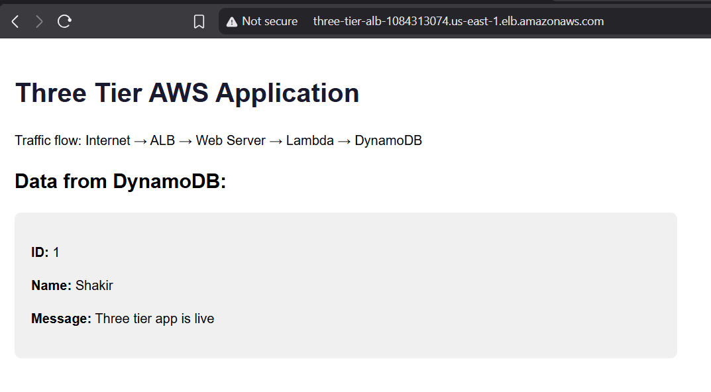
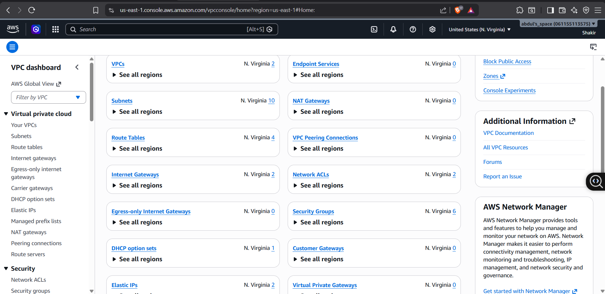
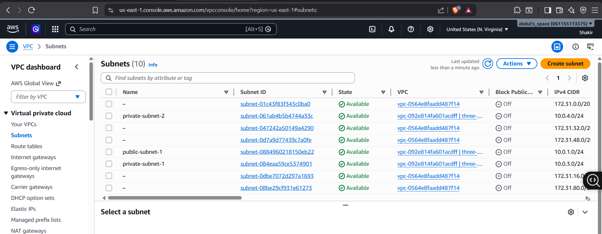
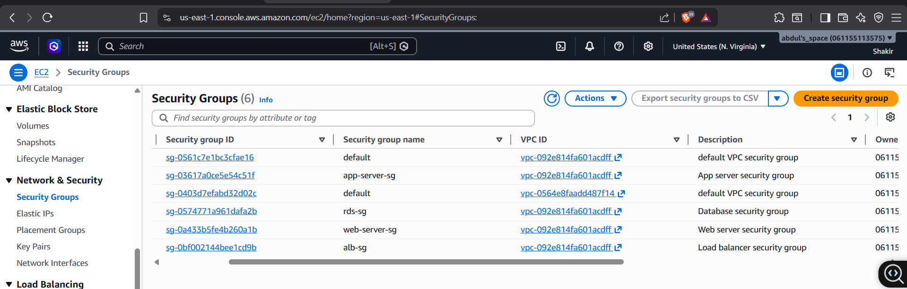
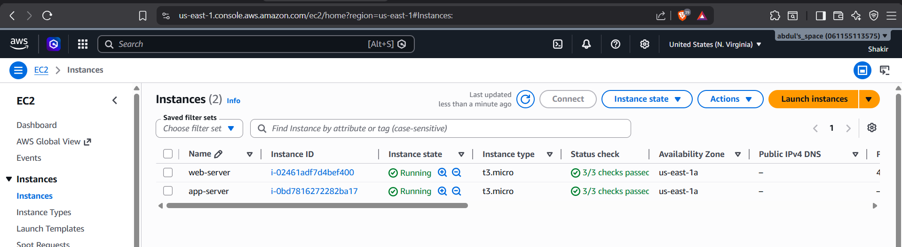
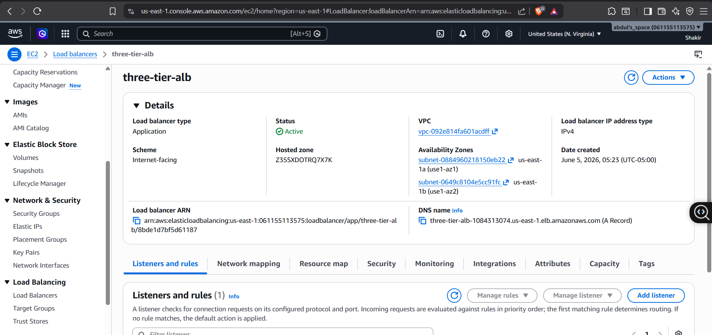
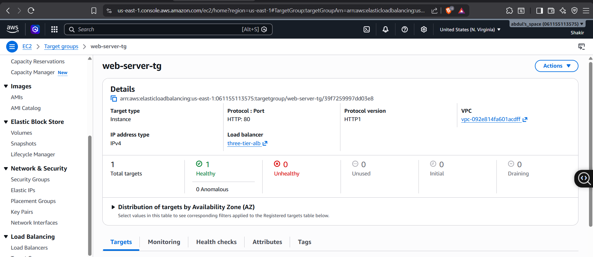
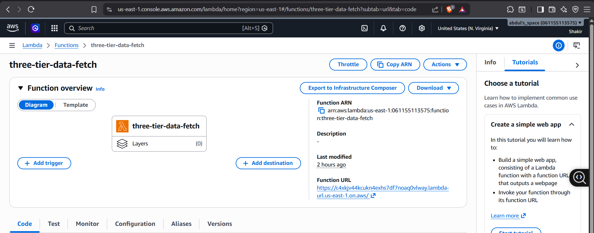
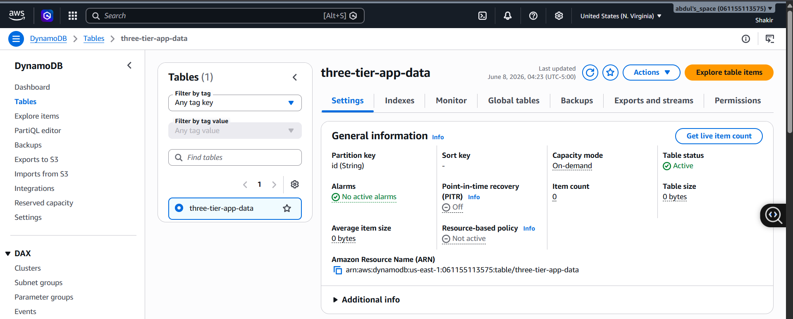

# Secure Three-Tier Web Application — AWS

## Live Site
[View Application](http://three-tier-alb-1084313074.us-east-1.elb.amazonaws.com)

## Architecture

Internet
↓
Application Load Balancer (public)
↓
EC2 Web Server — public subnet (us-east-1a)
↓
Lambda Function
↓
DynamoDB

## What I Built
A secure three-tier web application on AWS with full network isolation. Each tier only communicates with the tier directly above or below it. The database layer is completely unreachable from the internet.

## Services Used
| Service | Purpose |
|---|---|
| VPC | Isolated network with public and private subnets |
| EC2 | Web server in public subnet |
| ALB | Load balancer — single entry point from internet |
| Lambda | Serverless data fetch layer |
| DynamoDB | NoSQL data storage |
| IAM | Least privilege roles per service |
| Security Groups | Firewall rules per tier |

## Network Design
- VPC CIDR: `10.0.0.0/16`
- 2 public subnets across us-east-1a and us-east-1b
- 2 private subnets across us-east-1a and us-east-1b
- Internet Gateway for public subnet routing
- Private subnets have no internet route

## Security Design
- ALB accepts HTTP/HTTPS from internet only
- Web server accepts traffic from ALB only — not open internet
- App layer (Lambda) invoked by web server only
- DynamoDB accessible by Lambda role only
- No database exposed to public internet
- IAM roles scoped to minimum required permissions

## Traffic Flow
User → ALB → EC2 Web Server → Lambda Function URL → DynamoDB → response back to user

## Known Improvements
- HTTPS on ALB requires custom domain + ACM certificate
- NAT Gateway would allow private subnet instances to reach internet for updates

## Screenshots
### Live Application

### VPC Dashboard

### Subnets

### Security Groups

### EC2 Instances

### Application Load Balancer

### Target Group

### Lambda Function

### DynamoDB Table

